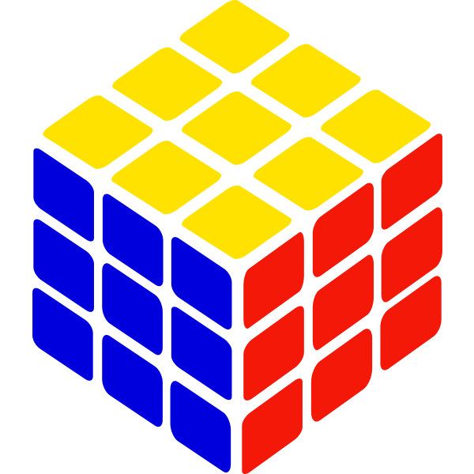

<a id="readme-top"></a>

<br />
<div align="center">
  <a href="https://github.com/BenjaminBerkrouber/rubik">
    
  </a>

  <h3 align="center">Rubik Solver</h3>

  <p align="center">
    Create the most efficient Rubik's cube solver with its 3D interface !
    <br />
    <a href="https://github.com/BenjaminBerkrouber/rubik/doc"><strong>Explore the docs »</strong></a>
    <br />
    <br />
    <a href="https://github.com/BenjaminBerkrouber/rubik">View Demo</a>
    &middot;
    <a href="https://github.com/BenjaminBerkrouber/rubik/issues/new?labels=bug&rubik=bug-report---.md">Report Bug</a>
    &middot;
    <a href="https://github.com/BenjaminBerkrouber/rubik/issues/new?labels=enhancement&rubik=feature-request---.md">Request Feature</a>
  </p>
</div>


<details>
  <summary>Table of Contents</summary>
  <ol>
    <li>
      <a href="#about-the-project">About The Project</a>
      <ul>
        <li><a href="#built-with">Built With</a></li>
      </ul>
    </li>
    <li>
      <a href="#getting-started">Getting Started</a>
      <ul>
        <li><a href="#prerequisites">Prerequisites</a></li>
        <li><a href="#installation">Installation</a></li>
      </ul>
    </li>
    <li><a href="#usage">Usage</a></li>
    <li><a href="#benchmarks">Benchmarks</a></li>
    <li><a href="#roadmap">Roadmap</a></li>
    <li><a href="#contributors">Contributors</a></li>
    <li><a href="#license">License</a></li>
    <li><a href="#evaluation-feedback">feedback</a></li>
  </ol>
</details>


## About The Project

<div align="center">
  <video controls width="720" poster="./assets/cube_poster.png">
    <source src="./assets/demo.mp4" type="video/mp4">
  </video>
</div>

___

RUBIK is a project developed as part of the curriculum at **42**.  
Our goal was to design a complete Rubik’s Cube solver capable of producing the most optimal solution possible while respecting strict constraints on **execution speed** and **memory efficiency**.

We aimed to build a solver that is not only correct, but also **fast, compact, and scalable**, relying on low-level operations and highly optimized data structures.

To achieve this, we worked as a team of two:

**Berkouber Benjamin** handled all the internal logic and algorithmic aspects, including:

- the in-memory representation of the cube using bytes,  
- the binary operations used to simulate rotations,  
- and the design, optimization, and validation of the solving algorithm.

**Patrick Rinderspacher** was responsible for the entire 3D component, essential for visualizing the cube and understanding the solving process step by step.  
This division of responsibilities allowed each part of the project to be developed with maximum precision and expertise.

By combining our skills, we aimed to deliver a Rubik’s Cube solver that is both **mathematically solid** and **visually intuitive**.

This repository includes:

- the full solver implementation,  
- the 3D rendering engine for visualization,  
- and detailed documentation explaining our approach, the internal data representation, and the algorithm we used.


<p align="right">(<a href="#readme-top">back to top</a>)</p>


### Built With

RUBIK is built using a lightweight and efficient C++ architecture, combined with a Makefile-based build system and an OpenGL rendering pipeline:

[![C++][Cpp.com]][Cpp-url] [![Makefile][Makefile.com]][Makefile-url] [![OpenGL][OpenGL.com]][OpenGL-url]

The project is structured around three core technical components:

- **Solving Algorithm** – The logic responsible for searching the optimal solution path.  
  → Full explanation: [`docs/ALGO.md`](docs/ALGO.md)

- **Cube Representation & Binary Operations** – A compact byte-based layout of the cube and all low-level transformations (bitwise rotations, permutations, etc.).  
  → Full explanation: [`docs/CUBE.md`](docs/CUBE.md) & [`docs/MOVES.md`](docs/MOVES.md)

- **3D Rendering Engine** – A real-time OpenGL visualization of the cube, used to display the resolution step by step.  
  → Full explanation: [`docs/RENDERING_3D.md`](docs/RENDERING_3D.md)


<p align="right">(<a href="#readme-top">back to top</a>)</p>


## Getting Started

This section explains how to set up and run the project locally.  
RUBIK is a C++ project built with a Makefile and includes an optional OpenGL 3D viewer.  
Follow the steps below to compile and execute the solver or the visualizer.

---

### Prerequisites

Before building the project, make sure you have the following installed:

- **C++17-compatible compiler** (GCC or Clang)  
- **Make**  
- **OpenGL** (for the 3D module)  
- **GLFW / GLEW** if your system requires them (Linux packages shown below)

#### Linux (Ubuntu/Debian)

```bash
sudo apt update
sudo apt install build-essential cmake libglfw3-dev libglew-dev libglm-dev
```

### Installation 

Floow these steps to clone and build the project: 

**1. Clone the repository**
```bash
git clone https://github.com/BenjaminBerkrouber/rubik.git
cd rubik
```
**2. Build the solver**
```bash
make && make table
```
This compiles the command-line Rubik’s Cube solver.
**2. Build the solver with 3D viewer**
```bash
make bonus && make table
```
This compiles the OpenGL visualization module developed by **Patrick Rinderspacher**.

<p align="right">(<a href="#readme-top">back to top</a>)</p>


## Usage

### Run the Solver (CLI)

The solver uses the **official Rubik’s Cube move notation** (Singmaster notation).  
If you want to apply a scramble and let the solver compute the solution, pass the sequence as an argument:

```bash
./rubik "B2 R2 L F U D"
```
Example:
```bash
./rubik "R U R' U' F2 D B' L2"
```

This command will:

1. Apply the given scramble to a solved cube,
2. Compute an optimized solution,
3. Print each step of the resolution in correct notation.


___
**Run the 3D Viewer**

To launch the OpenGL visualizer:
```bash
./rubik
```

This opens an interactive window that displays:
- the cube in real time,
- each rotation performed by the solver,
- and the full step-by-step resolution.

A detailed explanation of how the 3D viewer works can be found here:
[`docs/RENDERING_3D.md`](docs/RENDERING_3D.md)


<p align="right">(<a href="#readme-top">back to top</a>)</p>


---

## Benchmarks

We performed several benchmarks to validate the real performance of our solver.  
Detailed results and methodology are available in:  
➡️ [`docs/BENCHMARK.md`](docs/BENCHMARK.md)

### Memory Efficiency
Our cube representation fits entirely in **16 bytes**  
(compared to 72 bytes for a traditional 6×9 face model), allowing:

- faster state duplication  
- smaller search tree footprint  
- minimal cache miss impact  

**Key results:**
- Cube structure size: **16 bytes**  
- Copy time: **43 ns**  
- State comparison: **52 ns**

### Solver Execution Speed
We measured the resolution time on 1,000 random mixtures of 100 spins ofshuffle.

**Key averages (example values to replace):**
- Average search time: **0.20 ms**  
- Slowest scramble: **1.63 ms**  
- Fastest scramble: **0.04 ms**  
- Average moves count: **23 moves**  

The solver achieves performance comparable to optimized IDA*/Kociemba-style implementations.

<p align="right">(<a href="#readme-top">back to top</a>)</p>


## Roadmap

### Core Development

- 🟢 **DONE — Minimal in-memory cube encoding**  
  Compact byte-based representation to minimize memory usage.

- 🟢 **DONE — Fastest possible move application**  
  Ultra-optimized binary operations for rotation simulation.

- 🟢 **DONE — Optimized solving algorithm**  
  Research and implementation of an efficient search strategy (IDA\*, A\*, etc.).

### Visualization

- 🟢 **DONE — 3D rendering engine**  
  OpenGL-based real-time cube visualization.

- 🟢 **DONE — Solver ↔ Renderer connection**  
  Synchronization of solver output with graphical transitions.

### Validation & Documentation

- 🟢 **DONE — Full system testing**  
  Validation of correctness, robustness, and performance.

- 🟢 **DONE — Complete documentation**  
  Memory model, move system, algorithm, and rendering pipeline.

---

### Future Work (Planned)

- 🔵 **PLANNED — Hardware implementation (Raspberry Pi + motors + real cube)**  
  Build a physical version of RUBIK including:
  - cube state recognition (camera/sensors),
  - mechanical rotation via stepper motors,
  - Raspberry Pi controller,
  - real-world calibration and error tolerance.

  Requires several substeps:
  - 🔵 Cube state scanning  
  - 🔵 Mechanical structure & motor assembly  
  - 🔵 Communication between solver and hardware  
  - 🔵 Real cube movement execution  

---

➡ A detailed breakdown of each component is available in the `/docs` folder.


See the [open issues](https://github.com/BenjaminBerkrouber/rubik/issues) for a full list of proposed features (and known issues).

<p align="right">(<a href="#readme-top">back to top</a>)</p>


## Contributors

RUBIK has been entirely designed and developed by two students from École 42:

### 👤 Berkouber Benjamin
- Logic, algorithms, cube encoding, moves simulation, solver pipeline  
- [GitHub](https://github.com/BenjaminBerkrouber)  
- [LinkedIn](https://www.linkedin.com/in/benjaminberkrouber/)

### 👤 Patrick Rinderspacher
- Full 3D rendering engine, OpenGL viewer, real-time visualization  
- [GitHub](https://github.com/Porgatar)  
- [LinkedIn](https://www.linkedin.com/in/patrick-rinderspacher-936b25365/)

We combined our strengths to create a solver that is both **mathematically optimized** and **visually intuitive**.
<p align="right">(<a href="#readme-top">back to top</a>)</p>


## License

This project is released under the **MIT License**.

This means:
- You are free to use, copy, modify, merge, publish, distribute, sublicense, and/or sell copies of the software.
- You must include the original copyright notice.
- The software is provided *“as is”*, without any warranty of any kind.

Full license text is available in the `LICENSE` file.


<p align="right">(<a href="#readme-top">back to top</a>)</p>


## Evaluation Feedback

This project has been validated by **three different 42 evaluators**.  
Here are the summarized feedback notes (you can fill them):

### Evaluator 1
- **125/125** + ⭐ Outstanding Tag
- Comment : **“**
        Took the time to explain, know their subject, it's very hard to understand, but in any case, great work!
    **”**

### Evaluator 2
- **125/125** + ⭐ Outstanding Tag
- Comment : **“**
        The project is really comprehensive, and the work is well distributed. All the code is clean, and the resolution algorithm and graphics are also very well explained. The code is really well optimized. Big bonus for the tester that generates and scores relevant information. Congratulations on this truly perfect project! Very well explained too, a great team, well done and good luck for the future! Looking forward to grading another fun and visual project like this one :D
    **”**

### Evaluator 3
- **125/125** + ⭐ Outstanding Tag
- Comment : **“**
        Excellent work, the Python benchmark tool is really handy, the code is clean and easy to read, and the performance is very good. The graphics are very clean. Not much else to say except GG!
    **”**
<p align="right">(<a href="#readme-top">back to top</a>)</p>

___


[Cpp.com]: https://img.shields.io/badge/C++-00599C?style=for-the-badge&logo=cplusplus&logoColor=white
[Cpp-url]: https://isocpp.org/

[Makefile.com]: https://img.shields.io/badge/Makefile-000000?style=for-the-badge&logo=gnu&logoColor=white
[Makefile-url]: https://www.gnu.org/software/make/

[OpenGL.com]: https://img.shields.io/badge/OpenGL-5586A4?style=for-the-badge&logo=opengl&logoColor=white
[OpenGL-url]: https://www.opengl.org/
